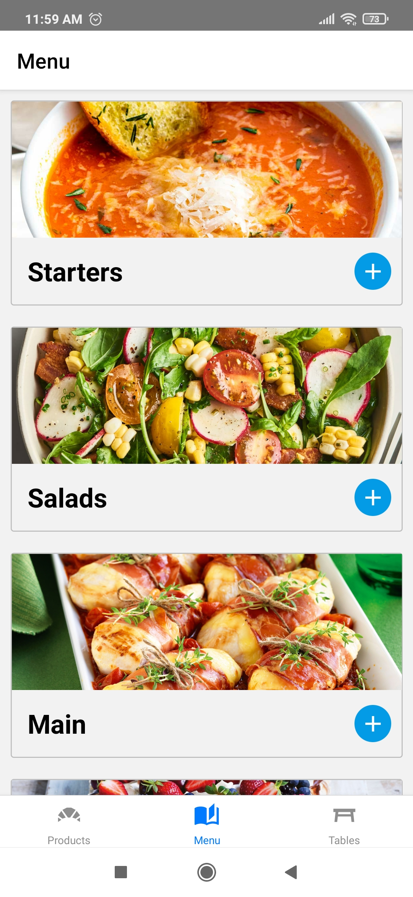
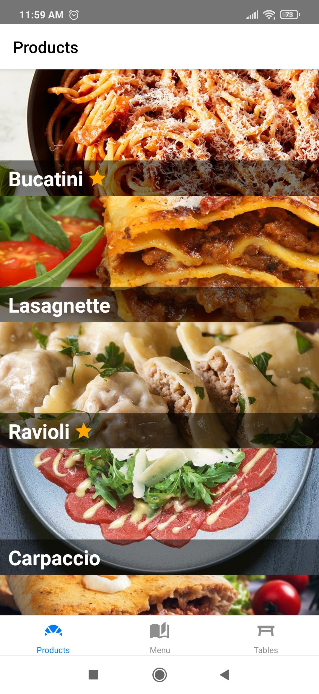
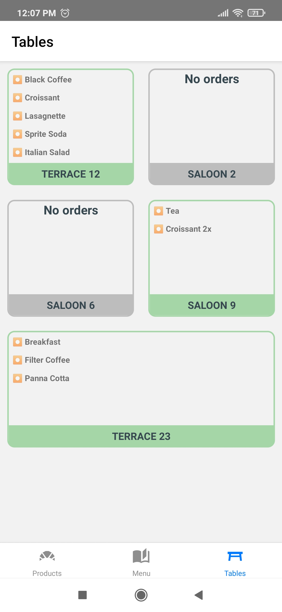

## Setup

- [Install React Native](https://reactnative.dev/docs/environment-setup)

- Create a folder then `git clone <My Repository Adress>` to clone github repository

- npm install for installing all the dependencies

- start your emulator or connect your physical device then start npm run android/ios(depending on your device)

## Tools & Resources

- [React Navigation](https://reactnavigation.org/) for page hierarchy
- [React Native Reanimated](https://docs.swmansion.com/react-native-reanimated/) for animated screens
- [React Native Vector Icons](https://github.com/oblador/react-native-vector-icons) for icons
